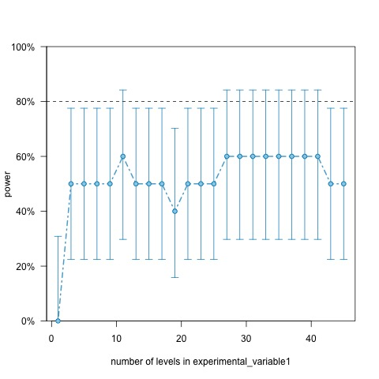
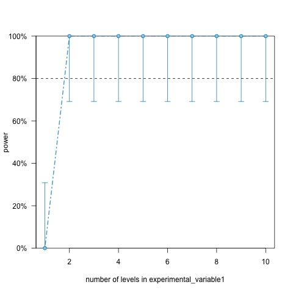

calcPower\_tutorial
================

## Introduction

This function uses simulation to perform power analysis. It is designed
to explore the power of biological experiments and to suggest an optimal
number of experimental variables with reasonable power. The backbone of
the function is based on `simr` package, which fits a fixed effect or
mixed effect model based on the observed data and simulates response
variables. Users can test the power of different combinations of
experimental variables and parameters.

## Installation
Install the `calcPower` package from GitHub using the following:
``` r
library(devtools)
install_github('gladstone-institutes/CalcPower', build_vignettes=TRUE)
```


## Function parameters
The `calculate_power` function has fifteen parameters, defined as follows:

 * data: (dataframe) the dataset to base the simulation upon 
 * condition\_column: (column name) cell status variable (e.g., control or case) 
 * experimental\_columns: (list of column names) variables related to the experimental design
 * response\_column: (column name) phenotype values
 * target\columns:  (column name) variable to estimate
 * power\_curve: (0 or 1) to get a power curve that calculates power for different levels of the target parameter => 1: Power simulation over a range of sample sizes or levels. 0: Power calculation over a single sample size or a level.
 * condition_is_categorical: Specify whether the condition variable is categorical. TRUE: Categorical, FALSE: Continuous.
 * response_is_categorical: Default: the observed variable is continuous Categorical response variable will be implemented in the future. TRUE: Categorical , FALSE: Continuous (default).
 * nsimn: (integer) number of iterations for power calculation (default is 1000 for high accuracy)
 * levels: (integer) nubmer of levels of the target parameter to explore. => 1: Amplify the number of corresponding target parameter. 0: Amplify the number of samples from the corresponding target parameter, ex) If target_columns = c("experiment","cell_line") and if you want to expand the number of experiment and sample more cells from each cell line, levels = c(1,0).
 * max_size: Maximum levels or sample sizes to test. Default: the current level or the current sample size x 5. ex) If max_levels = c(10,5), it will test upto 10 experiments and 5 cell lines.
 * breaks: Levels /sample sizes of the variable to be specified along the power curve.. Default: max(1, round( the number of current levels / 5 ))
 * effect_size: If you know the effect size of your condition variable, provided it. If the effect size is not provided, it will be estimated from your data
 * ICC: Intra-Class Coefficients (ICC) for each parameter
 * output: Output file name
 


## Ex1. Testing different levels of an experimental variable


Consider the situation in which nine independent experiments were performed to find an association between cell state and "feature1". Now we want to test the optimal number of experiments to obtain reasonable power to detect association. We will simulate the response variable (feature1) to estimate the relationship between number of experiments and power using existing experimental data. Since each experiment is independent of each other, '1' is assigned to the parameter 'level' to simulate independent experiments. If we don't specify 'max_size', level of experiments will tested upto max (observation level) x5. For example, the original data has nine experiments:

exp1, exp2, exp3, …, exp9

The simulation extends the experiment to 'exp45'. Example data 'calcPower_data1' is included in the package and the first few lines of this dataset are:

``` r
head(calcPower_data1)
#>   experiment plate  line classification feature1 feature2   feature3 feature4
#> 1       exp7     1 line1              0       62 3261.238   16.69571 118.4444
#> 2       exp7     1 line1              0       77 2033.726   54.10482 114.0946
#> 3       exp7     1 line1              0       56 1935.731 -100.00000 122.7329
#> 4       exp7     1 line1              0       54 1533.812 -100.00000 118.7066
#> 5       exp7     1 line1              0       19 1437.420 -100.00000 117.0279
#> 6       exp7     1 line1              0       30 1899.334 -100.00000 117.9523
#>   feature5
#> 1       10
#> 2       14
#> 3       13
#> 4       13
#> 5       19
#> 6       11
```


The example dataset consists of three experimental variables: "experiment", "plate" and "line", which should be assigned to 'experiment_columns'. Since we will be testing several experimental levels, we assign '1' to 'power_curve' to indicate that we want to create a power trend curve. 'condition_is_categorical' is TRUE as it is binary and this tutorial only runs 10 simulations to reduce computation time. It is recommended to use 100 to 1000 simulations for reproducible results.


#### code example:

``` r
calculate_power(data=calcPower_data1, condition_column="classification", experimental_columns=c("experiment","plate","line"),
                response_column="feature1", target_columns="experiment", power_curve=1, condition_is_categorical=TRUE,
                nsimn=10, levels=1) 
```



## Ex2. Testing different sample sizes of an experimental variable

Let us now consider the scenario where we want to estimate the power to detect an association between 'feature1' and cell conditions by changing the number of cells in each cell line. The example data set has the following number of cells for each cell line:

``` r
table(calcPower_data1$line)
#> 
#> line1 line2 line3 line4 line5 line6 line7 line8 
#>    42    40    37    51    71    37    42    20
```


We will test up to 71 x 5 cells per cell line using default settings. The other parameter settings are the same except for 'target_columns' where we input 'line' and 'levels' we assign '0' to because we are simulating multiple cells in the same cell line.


code example:

``` r
calculate_power(data=calcPower_data1, condition_column="classification", experimental_columns=c("experiment","plate","line"),
                  response_column="feature1", target_columns="line", power_curve=1, condition_is_categorical=TRUE,
                  nsimn=10, levels=0) 
```


## Ex3. User determined level count and output file name

Now instead of creating a power trend curve for multiple levels, we will test a specific number of independent experiments. We can achieve this by assigning '0' to 'pwoer_curve'. Test the case with 15 experiments by assigning '15' to 'max_size'. The function will output the estimated power for the given level. Assign 'test.txt' to 'output' to output the result. If we do not specify an output file name, the result is output to a file created using the current time as the suffix.


code example:\`

``` r
calculate_power(data=calcPower_data1, condition_column="classification", experimental_columns=c("experiment","plate","line"),
                response_column="feature1", target_columns="experiment", power_curve=0, condition_is_categorical=TRUE,
                nsimn=10, levels=1, max_size=15, output="test.txt") 
```


#### Result:

<p class="comment">

Power for predictor ‘condition\_column’, (95% confidence interval):  
80.00% (44.39, 97.48)  
  
Test: Likelihood ratio  
  
Based on 10 simulations, (0 warnings, 0 errors)  
alpha = 0.05, nrow = 544  
   
Time elapsed: 0 h 0 m 2 s  
  
nb: result might be an observed power calculation  

</p>


## Ex4. User determined effect size

Now we will estimate the power with the given effect size of the cell condition for feature1. We will assume an effect size of 10 and assign the value to the 'effect_size' parameter. Let's use the default max_size setting and the output file setting.


code example:

``` r
calculate_power(data=calcPower_data1, condition_column="classification", experimental_columns=c("experiment","plate","line"),
                response_column="feature1", target_columns="experiment", power_curve=0, condition_is_categorical=TRUE,
                nsimn=10, levels=1, effect_size = c(10)) 
```


##### Result:

<p class="comment">

Power for predictor ‘condition\_column’, (95% confidence interval):  
50.00% (18.71, 81.29)  
  
Test: Likelihood ratio  
  
Based on 10 simulations, (0 warnings, 0 errors)  
alpha = 0.05, nrow = 1700  
  
Time elapsed: 0 h 0 m 10 s

</p>

## Ex5. Test two target parameters

You can test more than one parameter for a single run. Suppose we are estimating power for two target parameters: experiment and cell line. We will test up to 9 experiments and up to 142 samples per cell line. The function will return two power curves for each target parameter.


code example:

``` r
calculate_power(data=calcPower_data1, condition_column="classification", experimental_columns=c("experiment","plate","line"),
                response_column="feature2", target_columns=c("experiment","line"), power_curve=1, condition_is_categorical=TRUE,
                nsimn=10, levels=c(1,0), max_size=c(9,142) )
```

  


## Ex6. Data with a single experimental category

Out power simulations depend on the variance components estimated from the input data set. However, there may not be enough data to estimate the variance component. For example, the pilot data might have only a single category for 'experiment', 'flat' or 'line'. Then we need to provide the ICC values estimated from another data set. ICC can be estimated by taking the ratio between the variance estimates using the following formula:

  

where V_i represents the standard deviation of the experimental variable i and epsilon represents the standard deviation of the error.
We will test this scenario using the example dataset with only single experiment and cell line:

``` r
table(calcPower_data2$experiment,calcPower_data2$plate,calcPower_data2$line)
#> , ,  = line1
#> 
#>       
#>         1
#>   exp1 14
```


code example:


``` r
calculate_power(data=calcPower_data1, condition_column="classification", experimental_columns=c("experiment","plate","line"),
                response_column="feature2", target_columns=c("experiment"), power_curve=1, condition_is_categorical=TRUE,
                nsimn=10, levels=c(1),  ICC=c(0.2,0.15,0.3))  
```


